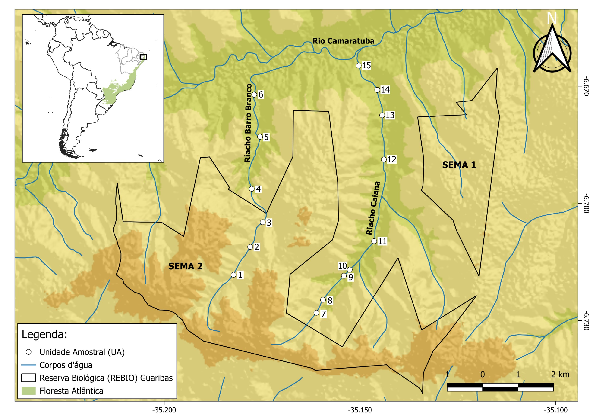

# Introdução

The scientific research follows the model shown in the figured cross-referenced here.

# Perguntas

O presente estudo propõe-se a responder às seguintes questões:

1.  Como as condições ambientais variam em riachos de Floresta Atlântica considerando os diferentes níveis de preservação ambiental e os períodos seco e chuvoso?
2.  A composição da comunidade zooplanctônica difere entre diferentes níveis de preservação ambiental e entre os períodos seco e chuvoso?
3.  Quais variáveis ambientais apresentam maior associação com a variação da composição da comunidade zooplanctônica?
4.  Quais táxons apresentam maior associação com os diferentes níveis de preservação ambiental?

# Hipóteses

Hipótese 1 – Variação das condições ambientais: Espera-se que as condições ambientais dos riachos apresentem variação ao longo dos gradientes de preservação ambiental e entre os períodos seco e chuvoso, refletindo diferenças na estrutura do habitat e nas características físico-químicas da água.

Hipótese 2 – Variação da composição da comunidade zooplanctônica: Mudanças na estrutura do habitat e nas características ambientais podem modificar os recursos disponíveis para o zooplâncton. Dessa forma, espera-se que a composição da comunidade zooplanctônica se altere entre os diferentes níveis de preservação ambiental e entre os períodos seco e chuvoso.

Hipótese 3 – Associação entre os preditores ambientais e a comunidade zooplanctônica: Considerando que as características ambientais dos riachos podem atuar de forma conjunta sobre a comunidade zooplanctônica, espera-se que parte da variação na composição da comunidade seja explicada pelas variáveis relacionadas às condições ambientais, com algumas variáveis sendo mais significativas do que outras.

Hipótese 4 – Táxons indicadores: Tendo em vista que diferentes condições ambientais podem favorecer determinados grupos, espera-se que alguns táxons da comunidade zooplanctônica estejam mais associados a determinados níveis de preservação ambiental, podendo atuar como indicadores da condição ambiental.

# Objetivos

## Objetivo Geral

Identificar os principais preditores ambientais associados à composição da comunidade zooplanctônica em riachos inseridos em um remanescente de Floresta Atlântica, considerando diferentes níveis de preservação ambiental e os períodos seco e chuvoso.

## Objetivos Específicos

-   Caracterizar os principais gradientes de estrutura do habitat e das condições ambientais ao longo dos riachos, considerando os diferentes níveis de preservação ambiental e os períodos seco e chuvoso.

-   Avaliar a variação da composição da comunidade zooplanctônica, entre os diferentes níveis de preservação ambiental e os períodos seco e chuvoso.

-   Identificar as variáveis ambientais que apresentam maior associação com a variação na composição da comunidade zooplanctônica.

-   Determinar quais preditores ambientais selecionados apresentam maior contribuição para explicar a variação da composição da comunidade zooplanctônica.

-   Identificar os táxons associados aos diferentes níveis de preservação ambiental e aos períodos seco e chuvoso.

# Material e Métodos

## Área de estudo e delineamento amostral

O estudo foi realizado na Reserva Biológica Guaribas (REBIO Guaribas), unidade de conservação federal localizada no estado da Paraíba. Criada em 1990, a REBIO Guaribas é constituída por três fragmentos descontínuos, denominados SEMA 01, SEMA 02 e SEMA 03, constituindo um dos últimos remanescentes de Floresta Atlântica na região. A vegetação da unidade de conservação é composta principalmente por floresta estacional semidecidual e formações savânicas, com influência da Caatinga adjacente. A REBIO Guaribas está localizada no município de Mamanguape, mas também sofre influência de Rio Tinto, Curral de Cima, Jacaraú e Marcação, estando inserida em uma região caracterizada pelo predomínio de áreas agrícolas [@mma2003].

A área de entorno da REBIO Guaribas apresenta diferentes formas de uso e cobertura do solo, incluindo áreas de agricultura, pastagem e pequenas propriedades rurais [@mma2026; @arruda2013]. Entre as principais atividades desenvolvidas na região estão o cultivo de cana-de-açúcar, abacaxi e coqueiro, além da pecuária, pomares e roçados de subsistência [@heinrichs2017; @gouveia2017]. Esses usos podem influenciar os ambientes aquáticos adjacentes por meio do escoamento superficial, da alteração da vegetação ripária e da entrada de sedimentos, nutrientes e outros materiais nos riachos [@mma2003; @soler2004].

O clima regional é classificado como As', segundo Köppen-Geiger, com estação chuvosa entre fevereiro e julho e período seco entre outubro e dezembro [@peel2007]. A temperatura média anual varia entre 24 e 26 °C, enquanto a precipitação anual é de aproximadamente 1.750 a 2.000 mm. A drenagem local é composta por pequenos riachos de cabeceira, cuja dinâmica está relacionada ao regime de precipitação. Entre esses ambientes, destacam-se os riachos Barro Branco e Caiana, escolhidos como áreas de estudo deste trabalho, ambos pertencentes à bacia do rio Camaratuba [@gouveia2017].

O delineamento amostral foi estruturado considerando dois períodos sazonais e diferentes níveis de preservação ambiental. As coletas foram realizadas durante o período seco, entre novembro de 2023 e fevereiro de 2024, e durante o período chuvoso, entre junho e agosto de 2024. Foram estabelecidas 15 unidades amostrais (UAs), distribuídas nos riachos Barro Branco e Caiana, localizados no fragmento SEMA 02 da REBIO Guaribas, abrangendo áreas no interior da unidade de conservação e áreas sob influência antrópica em seu entorno (@fig-mapa). No riacho Barro Branco, foram estabelecidas seis unidades amostrais (UAs 1 a 6), distribuídas longitudinalmente ao longo do curso d’água. As UAs 1 a 3 estavam localizadas no interior da REBIO Guaribas, enquanto as UAs 4 a 6 estavam situadas na zona de amortecimento. No riacho Caiana, foram estabelecidas nove unidades amostrais (UAs 7 a 15), distribuídas em trechos sob maior influência de áreas de pastagem e cultivo agrícola.

Em cada unidade amostral, foram coletados dados referentes à estrutura do habitat, à qualidade da água e à fauna zooplanctônica. Foram realizadas três subamostragens em diferentes habitats dentro de cada unidade amostral, totalizando 45 subamostras (15 UAs × 3 subamostras) para cada período sazonal.

As unidades amostrais foram classificadas quanto ao nível de preservação ambiental a partir das características observadas no entorno e no próprio trecho amostrado, considerando principalmente a condição da vegetação ripária, o uso e a cobertura do solo adjacente e as características gerais do habitat. A classificação resultou em quatro condições de preservação, organizadas em um gradiente que variou de trechos mais preservados a trechos sob maior influência antrópica. As condições foram definidas *a priori*, antes da análise das respostas biológicas, de modo que o nível de preservação fosse considerado uma característica espacial independente dessas respostas.

-   Tipo I: corresponde às unidades amostrais localizadas no interior da área protegida e que apresentam condições bem preservadas, caracterizadas pela presença de vegetação ripária íntegra e ausência de áreas de cultivo nas proximidades, considerando uma distância mínima de 1 km. Essas unidades também atendem aos critérios de qualidade da água estabelecidos como referência, com temperatura média ≤ 28 °C, concentração média de oxigênio dissolvido ≥ 6 mg/L, velocidade média da água ≥ 0,025 m/s e turbidez média ≤ 15 NTU.

-   Tipo II: corresponde às unidades amostrais localizadas no interior da área protegida, mas que apresentam algum grau de alteração ambiental. Essas alterações podem estar relacionadas à proximidade de áreas de cultivo ou a desvios em uma ou mais das características hidrológicas e de qualidade da água utilizadas como referência para o Tipo I.

-   Tipo III: corresponde às unidades amostrais localizadas fora da área protegida, mas que mantêm condições de qualidade da água relativamente boas, comparáveis às observadas no Tipo I. Essas unidades podem, entretanto, apresentar diferenças em outras características ambientais relacionadas à sua localização fora da área protegida.

-   Tipo IV: corresponde às unidades amostrais localizadas fora da área protegida e que apresentam evidências de maior perturbação ambiental. Essas alterações incluem condições de qualidade da água inferiores às observadas nas unidades de referência, não atendendo a pelo menos um dos critérios estabelecidos para o Tipo I, e/ou alterações nas características do habitat.

Para as unidades amostrais dos Tipos III e IV, não foram considerados os critérios de proximidade da vegetação ripária e de áreas de cultivo utilizados na classificação das unidades dos Tipos I e II. Por estarem localizadas fora da REBIO Guaribas, essas unidades estão sujeitas a diferentes condições de uso e cobertura do solo e, portanto, não necessariamente apresentam vegetação ripária íntegra ou distância mínima de 1 km de áreas de cultivo. A classificação das unidades amostrais foi posteriormente avaliada em conjunto com as medições das variáveis ambientais realizadas em campo.

## Coleta de dados ambientais

Para caracterizar as condições ambientais de cada unidade amostral, foram avaliados quatro conjuntos de variáveis: (a) morfologia do local, (b) qualidade da água, (c) composição do sedimento e (d) estrutura do habitat marginal.

A morfologia do local foi caracterizada pela medição da largura (cm) e da profundidade (cm) do curso d'água em três transectos selecionados aleatoriamente, utilizando trena métrica. A inclinação das margens foi classificada como 1 para declive de até 20°, 2 para declive de 20 a 30°, 3 para declive entre 30 e 50° e 4 para declive das margens superior a 50°. Variáveis em escala de bacia hidrográfica, como altitude, comprimento do curso d'água, forma dos ambientes e distância entre as unidades amostrais, foram obtidas utilizando GPS portátil e imagens de satélite [@medeiros2008].

A qualidade da água foi avaliada por meio de variáveis físico-químicas. Em campo, foram medidos o oxigênio dissolvido (mg/L) e a temperatura da água (°C) por meio de oxímetro portátil (LUTRON DO-5510). A velocidade da corrente (m/s) foi estimada pelo método do flutuador descrito por @maitland1990. Em laboratório, no Laboratório de Ecologia da UEPB – Campus V, foram determinados os valores de pH (TECNOPON MPA-210), condutividade elétrica (TECNOPON MCS-150) e turbidez, utilizando turbidímetro com base em amostras de água coletadas em cada unidade amostral.

A composição do sedimento e a estrutura física do habitat foram avaliadas seguindo protocolos propostos por @pusey2004 e @mugodo2006, adaptados por @medeiros2008. Essas variáveis foram estimadas a partir de 9 a 12 quadrantes de um metro distribuídos ao longo das margens do curso d'água (interface terrestre-aquática), por meio de transectos paralelos às margens dos corpos d'água, representando a proporção média (%) de cobertura dos atributos avaliados. Dentro de cada quadrante, a porcentagem de cobertura dos tipos de sedimento (lama, areia, seixos, cascalho fino, cascalho grosso, rochas e rocha matriz) e das estruturas do habitat litorâneo e subaquático foi estimada visualmente. As variáveis de estrutura do habitat incluíram macrófitas aquáticas, gramíneas marginais, serapilheira, algas aderidas, algas filamentosas, vegetação suspensa, vegetação submersa, liteira, pequenos detritos lenhosos, grandes detritos lenhosos, massas radiculares, raízes e galhos.

## Coleta do zooplâncton

O zooplâncton foi coletado quantitativamente utilizando uma rede de plâncton com abertura de 30 cm de diâmetro, 70 cm de comprimento e malha de 68 μm. Em cada unidade amostral, foram definidos três tipos distintos de hábitat, sendo filtrados 50 L de água por hábitat, totalizando 150 L por unidade amostral. O material retido na rede foi transferido para frascos plásticos graduados de 80 mL [@pinto-coelho2004]. As amostras foram anestesiadas com água gasosa comercial (CO₂) e posteriormente fixadas em formalina a 4%, neutralizada com sacarose, com o objetivo de reduzir distorções estruturais, evitar a perda de ovos e garantir a preservação das características morfológicas necessárias à identificação taxonômica [@haney1973]. No laboratório, todo o volume concentrado de cada amostra foi analisado, sendo os indivíduos identificados até o menor nível taxonômico possível e contados em câmara de contagem do tipo Sedgwick–Rafter (1 mL), com auxílio de microscópio óptico (Olympus CX31), chaves de identificação especializadas e outros materiais de apoio relacionados [@elmoor-loureiro1997; @koste1987; @joko2011].

As análises foram realizadas no Laboratório de Ecologia da Universidade Estadual da Paraíba (UEPB), Campus V, e apenas rotíferos, cladóceros e copépodes foram considerados no presente estudo.

## Statistical Analyses

Here you can add your statistical analyses and follow the text with the RStudio code. Following the model in <https://elviomedeiros.github.io/Bentos2006_Q/>.

```{r, CHUNK-TITLE}
#| eval: false
#| message: false
#| warning: false
#| results: false
#| echo: true
#| purl: false
#| code-fold: true
#| code-overflow: wrap
#| code-summary: "Code: Summary"

plot(1:10)
```

# Results

The results section should follow the model in <https://elviomedeiros.github.io/Bentos2006_Q/>.

## Environmental variables

## Community structure

# Discussion

# Conclusions {.unnumbered}

# Acknowledgements {.unnumbered}

# Authorship contribution statement {.unnumbered}

Authorship of this paper is based on @credit2026.

Author1: Writing – review & editing, Writing – original draft, Formal analysis, Data curation, Conceptualization. Author2: Writing – review & editing, Data curation, Conceptualization. Author3: Writing – review & editing, Formal analysis, Data curation, Conceptualization.

# Ethical approval {.unnumbered}

This study did not require ethical approval as it did not involve human participants or sensitive data. Field surveys were conducted based on collection permit number (IEF-10327-6 and SISBIO-10.635-7).

# Referências {.unnumbered}

::: {#refs}
:::

\pagebreak
\newpage

# Figuras e Tabelas {.unnumbered}

@fig-mapa: Localização das unidades amostrais nos riachos Barro Branco e Caiana, na Reserva Biológica Guaribas, Mamanguape, Paraíba. A unidade amostral 1 corresponde ao local de referência do estudo.

## Figuras {.unnumbered}

<details>

<summary>Fig.: Localização das unidades amostrais</summary>

{#fig-mapa}

<details>

## Tables {.unnumbered}

\pagebreak
\newpage

# Apendices {.unnumbered}

# Non-used figures and tables {.unnumbered}

::: callout-warning
# Non-used codes

```{r}
#| label: non-used code
#| eval: false
#| warning: false
#| message: false
#| results: false
#| code-fold: true
#| code-overflow: wrap
#| code-summary: "non-used code" 

table(1:10)
```
:::
